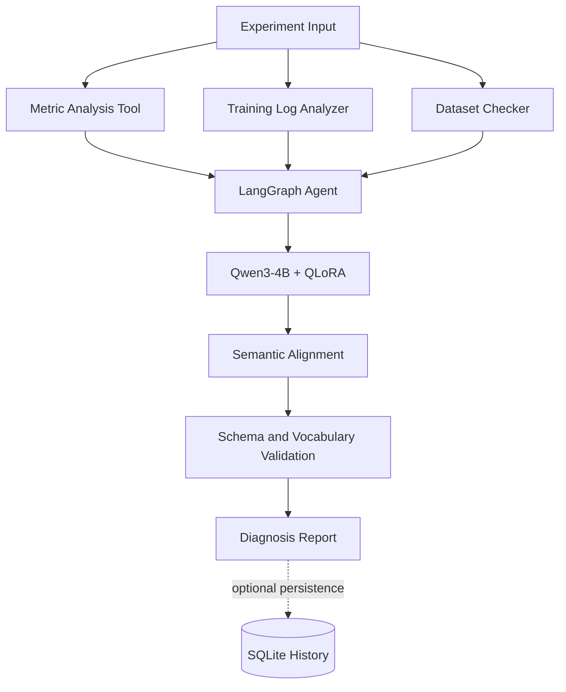

# DeepLearning-Copilot: Agent-based Deep Learning Experiment Diagnosis System

[English](README.md) | [简体中文](README.zh-CN.md)

DeepLearning-Copilot is an engineering-oriented system for diagnosing deep learning experiments from structured metrics, training curves, and dataset statistics. It combines deterministic feature extraction with a controlled LLM Agent workflow and a QLoRA fine-tuned Qwen3 model.

The Agent is an orchestration layer over the existing dataset, feature, rule, ground-truth, and evaluation components. It coordinates tools, builds model context, validates structured model output, and formats a diagnosis report. It does not replace the project's deterministic analysis or create new diagnostic rules.

## Highlights

- **LLM Agent orchestration** through a fixed, reproducible workflow
- **LangGraph workflow** for state and node coordination
- **Tool-based evidence extraction** from metrics, training logs, and dataset statistics
- **Qwen3-4B with a QLoRA adapter** for diagnosis reasoning, evidence selection, and recommendations
- **Schema-controlled experiment diagnosis** with canonical evidence and action codes
- **SQLite execution history** and system-level Agent evaluation

## System Architecture



The fixed workflow is:

```text
Experiment Input
    ↓
Metric Analysis Tool + Training Log Analyzer + Dataset Checker
    ↓
Context Construction and LangGraph State Management
    ↓
Qwen3-4B-Instruct-2507 + Final QLoRA Adapter
    ↓
Deterministic Semantic Alignment
    ↓
Output Schema and Vocabulary Validation
    ↓
Diagnosis Report
```

### Responsibility boundaries

| Component | Responsibility |
|---|---|
| Tool adapters | Call existing feature calculation functions and return structured evidence |
| LangGraph Agent | Manage workflow state, tool execution, context construction, model invocation, and reporting |
| QLoRA diagnosis model | Perform diagnosis reasoning, evidence selection, and recommendation generation |
| Semantic Alignment | Normalize explicitly approved model aliases to existing project vocabulary |
| Output Validator | Enforce the existing JSON schema and evidence/action vocabularies |
| SQLite Storage | Record experiments, executions, tool results, raw output, diagnosis, and reports |
| Agent Evaluation | Aggregate workflow, tool, validation, and diagnosis-distribution statistics |

The existing Rule Engine, Ground Truth Builder, Dataset Pipeline, and model training pipeline remain separate and unchanged.

## Output Contract

Every validated diagnosis contains:

```json
{
  "task_type": "experiment_diagnosis",
  "primary_issue": "overfitting",
  "severity": "medium",
  "evidence_codes": [
    "strong_generalization_gap",
    "late_validation_degradation"
  ],
  "recommended_action_codes": [
    "increase_regularization",
    "use_early_stopping"
  ],
  "explanation": "A concise explanation based on the supplied evidence."
}
```

Valid values are defined by:

- [`configs/output_schema_v1.json`](configs/output_schema_v1.json)
- [`configs/output_vocabulary_v1.json`](configs/output_vocabulary_v1.json)

## Technology Stack

| Technology | Usage |
|---|---|
| Python | Application, tooling, storage, and evaluation |
| PyTorch | Model runtime |
| Transformers | Qwen tokenizer and causal language model loading |
| PEFT | Loading the fine-tuned adapter |
| QLoRA | Parameter-efficient diagnosis-model fine-tuning |
| LangGraph | Controlled Agent workflow orchestration |
| SQLite | Local experiment and execution history |
| JSON Schema | Structured output validation |

## Repository Structure

```text
DeepLearning-Copilot/
├── configs/                 # Taxonomy, schema, vocabulary, and training configs
├── docs/                    # Agent specification and project documentation
├── examples/                # Runnable structured experiment examples
├── scripts/                 # Dataset, training, validation, and Demo entry points
├── src/
│   ├── agent/               # LangGraph state, nodes, workflow, service, context builder
│   ├── evaluation/          # Existing evaluation modules and Agent system statistics
│   ├── inference/           # QLoRA wrapper, parser, and semantic alignment
│   ├── storage/             # SQLite experiment history
│   └── tools/               # ToolResult contract and evidence adapters
└── tests/                   # Unit and integration tests
```

## Setup

Python 3.11 is the project baseline. A CUDA-capable environment is recommended for real QLoRA inference.

1. Install a PyTorch build compatible with the local CUDA runtime.
2. Install project and Agent dependencies:

```bash
pip install -r requirements.txt
pip install -r requirements-agent-v1.txt
```

3. Place the base model and adapter at the configured paths:

```text
models/Qwen3-4B-Instruct-2507
models/qwen3-4b-dlcopilot-final-qlora
```

The inference wrapper lazily loads the model on first use with 4-bit NF4 quantization and reuses it within the process. Real inference therefore requires sufficient GPU support plus compatible PyTorch, Transformers, PEFT, and bitsandbytes installations.

## Model Availability

Real diagnosis uses the following local model artifacts:

- Base model: `Qwen3-4B-Instruct-2507`
- Fine-tuned adapter: `qwen3-4b-dlcopilot-final-qlora`

Model weights are not committed to this Git repository. Obtain the base model and adapter through their applicable distribution channels and licenses, then place them under the repository root as follows:

```text
models/
├── Qwen3-4B-Instruct-2507/
│   ├── config.json
│   ├── tokenizer files
│   └── model weight shards
└── qwen3-4b-dlcopilot-final-qlora/
    ├── adapter_config.json
    └── adapter_model.safetensors
```

The repository's MIT License covers the project code and documentation. Third-party base-model and adapter artifacts remain subject to their respective licenses and access terms.

## Run the CLI Demo

Run the overfitting example from the repository root:

```bash
python scripts/demo_agent.py --input examples/demo_overfitting.json
```

The CLI reads the JSON input, calls the existing `run_diagnosis()` service, and displays:

- Experiment ID
- Task Type
- Primary Issue
- Severity
- Evidence Codes
- Recommended Action Codes
- Explanation

The CLI is only an input and presentation layer. It does not modify the diagnosis or add evidence and recommendations.

## Demo Cases

| Example | Intended input pattern | Command |
|---|---|---|
| Overfitting | Training performance improves while validation performance degrades late, producing a generalization gap | `python scripts/demo_agent.py --input examples/demo_overfitting.json` |
| Class Imbalance | Skewed class counts together with a large per-class performance gap | `python scripts/demo_agent.py --input examples/demo_class_imbalance.json` |
| Healthy Training | Similar train/validation performance with balanced class counts and small per-class gaps | `python scripts/demo_agent.py --input examples/demo_healthy.json` |

These files are demonstration inputs, not embedded ground truth. The final response is produced by the configured diagnosis model and must pass the existing output contract.

## Engineering Features

### SQLite history

The optional SQLite storage layer records experiment context, execution status and timestamps, serialized ToolResults, raw model output, validated diagnosis, and the generated report. Storage failures are isolated from diagnosis results.

### Agent Evaluation

System-level evaluation aggregates:

- workflow success rate
- per-tool call, success, and failure counts
- validation pass rate
- primary-issue distribution

It evaluates Agent execution behavior, not the correctness of the QLoRA diagnosis against Ground Truth.

### Output Validation

Model output is extracted as JSON and checked against the existing schema and canonical evidence/action vocabularies. Unknown values remain validation errors unless they have an explicitly approved alias.

### Semantic Alignment

The deterministic alignment layer normalizes confirmed label drift before validation. It performs field-specific string mapping, explanation synchronization, and stable array deduplication. It does not inspect features, invoke the Rule Engine, or generate diagnosis content.

## Testing

Run the test suite from the repository root:

```bash
python -m unittest discover -s tests -p "test_*.py" -v
```

Tests use mock diagnosis results where appropriate, so Agent workflow and CLI tests do not require loading the real QLoRA model.

## Current Scope

DeepLearning-Copilot is a controlled engineering prototype for experiment-diagnosis research and demonstration. It does not claim perfect diagnosis, expert replacement, or production deployment readiness.

Agent v1 intentionally excludes multi-agent planning, reflection loops, RAG, vector databases, external experiment trackers, and autonomous rule creation. Diagnosis quality depends on the supplied experiment data, feature coverage, adapter behavior, and output-contract compliance.

For the detailed Agent boundary and design specification, see [`docs/AGENT_V1_SPEC.md`](docs/AGENT_V1_SPEC.md).

## License

Project code and documentation are released under the [MIT License](LICENSE).
