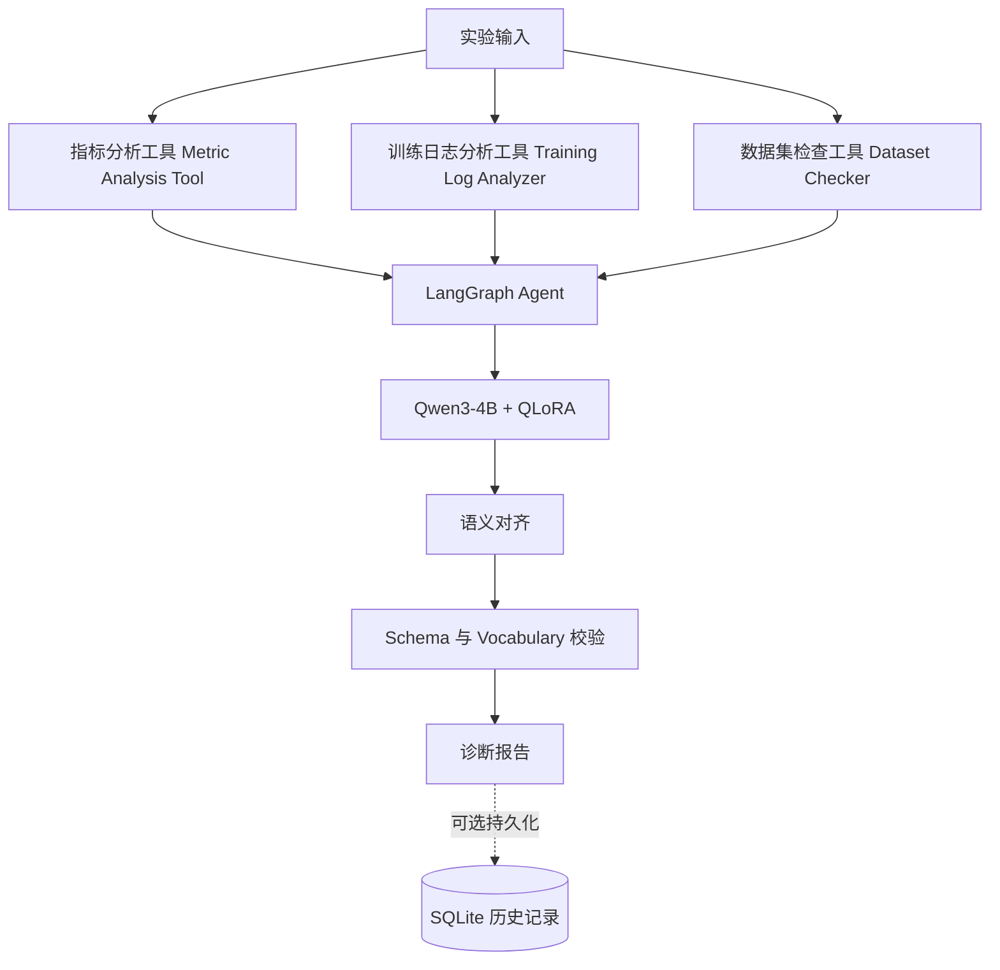

# DeepLearning-Copilot：基于 Agent 的深度学习实验诊断系统

[English](README.md) | [简体中文](README.zh-CN.md)

DeepLearning-Copilot 是一个面向工程实践的深度学习实验诊断系统。它从结构化实验指标、训练曲线和数据集统计信息中提取证据，并结合受控的 LLM Agent 工作流与经过 QLoRA 微调的 Qwen3 模型生成诊断报告。

Agent 是构建在项目既有数据集、特征、规则、Ground Truth 和评估模块之上的编排层。它负责协调工具、构建模型上下文、校验结构化模型输出并格式化诊断报告，不替代项目已有的确定性分析，也不创建新的诊断规则。

## 项目亮点

- 通过固定、可复现的工作流实现 **LLM Agent 编排**
- 使用 **LangGraph** 管理工作流状态和节点协作
- 通过指标、训练日志和数据集工具进行**结构化证据提取**
- 使用 **Qwen3-4B + QLoRA Adapter** 完成诊断推理、证据选择和建议生成
- 使用 JSON Schema 与受控词表约束实验诊断输出
- 支持 SQLite 实验历史和 Agent 系统级评估

## 系统架构



固定工作流如下：

```text
实验输入
    ↓
指标分析工具 + 训练日志分析工具 + 数据集检查工具
    ↓
上下文构建与 LangGraph 状态管理
    ↓
Qwen3-4B-Instruct-2507 + Final QLoRA Adapter
    ↓
确定性语义对齐
    ↓
输出 Schema 与 Vocabulary 校验
    ↓
诊断报告
```

### 模块职责边界

| 组件 | 职责 |
|---|---|
| Tool Adapter | 调用既有特征计算函数并返回结构化证据 |
| LangGraph Agent | 管理工作流状态、工具执行、上下文构建、模型调用和报告生成 |
| QLoRA 诊断模型 | 完成诊断推理、证据选择和建议生成 |
| Semantic Alignment | 将明确批准的模型别名归一化为项目已有词表 |
| Output Validator | 执行既有 JSON Schema 和 evidence/action 词表校验 |
| SQLite Storage | 记录实验、执行过程、工具结果、原始模型输出、诊断和报告 |
| Agent Evaluation | 汇总工作流、工具、校验和诊断分布统计 |

既有 Rule Engine、Ground Truth Builder、Dataset Pipeline 和模型训练流程保持独立且不被 Agent 替代。

## 输出协议

每个通过校验的诊断结果包含：

```json
{
  "task_type": "experiment_diagnosis",
  "primary_issue": "overfitting",
  "severity": "medium",
  "evidence_codes": [
    "strong_generalization_gap",
    "late_validation_degradation"
  ],
  "recommended_action_codes": [
    "increase_regularization",
    "use_early_stopping"
  ],
  "explanation": "基于输入证据生成的简要解释。"
}
```

合法值由以下配置定义：

- [`configs/output_schema_v1.json`](configs/output_schema_v1.json)
- [`configs/output_vocabulary_v1.json`](configs/output_vocabulary_v1.json)

## 技术栈

| 技术 | 用途 |
|---|---|
| Python | 应用逻辑、工具、存储和评估 |
| PyTorch | 模型运行时 |
| Transformers | 加载 Qwen Tokenizer 和因果语言模型 |
| PEFT | 加载微调 Adapter |
| QLoRA | 参数高效的诊断模型微调 |
| LangGraph | 受控 Agent 工作流编排 |
| SQLite | 本地实验与执行历史 |
| JSON Schema | 结构化输出校验 |

## 项目目录

```text
DeepLearning-Copilot/
├── configs/                 # 分类体系、Schema、Vocabulary 和训练配置
├── docs/                    # Agent 规格与项目文档
├── examples/                # 可运行的结构化实验案例
├── scripts/                 # 数据集、训练、校验和 Demo 入口
├── src/
│   ├── agent/               # LangGraph 状态、节点、工作流、服务和上下文构建
│   ├── evaluation/          # 既有评估模块与 Agent 系统统计
│   ├── inference/           # QLoRA Wrapper、输出解析与语义对齐
│   ├── storage/             # SQLite 实验历史
│   └── tools/               # ToolResult 协议和证据适配器
└── tests/                   # 单元测试与集成测试
```

## 环境配置

项目以 Python 3.11 为基线。运行真实 QLoRA 推理时建议使用支持 CUDA 的环境。

1. 根据本地 CUDA 环境安装兼容的 PyTorch。
2. 安装项目和 Agent 依赖：

```bash
pip install -r requirements.txt
pip install -r requirements-agent-v1.txt
```

3. 将基础模型和 Adapter 放置在配置路径：

```text
models/Qwen3-4B-Instruct-2507
models/qwen3-4b-dlcopilot-final-qlora
```

推理 Wrapper 会在第一次调用时以 4-bit NF4 方式延迟加载模型，并在同一进程内复用。真实推理需要足够的 GPU 资源，以及相互兼容的 PyTorch、Transformers、PEFT 和 bitsandbytes 环境。

## 模型可用性

真实诊断使用以下本地模型文件：

- 基础模型：`Qwen3-4B-Instruct-2507`
- 微调 Adapter：`qwen3-4b-dlcopilot-final-qlora`

模型权重不会提交到本 Git 仓库。请根据模型对应的发布渠道和许可证获取基础模型与 Adapter，然后在仓库根目录按以下结构放置：

```text
models/
├── Qwen3-4B-Instruct-2507/
│   ├── config.json
│   ├── tokenizer files
│   └── model weight shards
└── qwen3-4b-dlcopilot-final-qlora/
    ├── adapter_config.json
    └── adapter_model.safetensors
```

本仓库的 MIT License 适用于项目代码与文档。第三方基础模型和 Adapter 文件仍受各自许可证及访问条款约束。

## 运行 CLI Demo

在仓库根目录运行 Overfitting 案例：

```bash
python scripts/demo_agent.py --input examples/demo_overfitting.json
```

CLI 会读取 JSON 输入，调用既有的 `run_diagnosis()` 服务，并展示：

- Experiment ID
- Task Type
- Primary Issue
- Severity
- Evidence Codes
- Recommended Action Codes
- Explanation

CLI 只负责输入和结果展示，不修改 diagnosis，也不添加 evidence 或 recommendation。

## Demo 案例

| 案例 | 输入特征 | 命令 |
|---|---|---|
| Overfitting | 训练性能持续提升，但验证性能后期下降，并产生明显泛化差距 | `python scripts/demo_agent.py --input examples/demo_overfitting.json` |
| Class Imbalance | 类别数量分布偏斜，同时存在明显逐类性能差距 | `python scripts/demo_agent.py --input examples/demo_class_imbalance.json` |
| Healthy Training | 训练与验证性能接近，类别数量均衡且逐类性能差距较小 | `python scripts/demo_agent.py --input examples/demo_healthy.json` |

这些文件只是演示输入，不包含嵌入式 Ground Truth。最终结果由配置的诊断模型生成，并且必须通过既有输出协议校验。

## 工程特性

### SQLite 实验历史

可选的 SQLite Storage 能够记录实验上下文、执行状态与时间、序列化 ToolResult、原始模型输出、通过校验的 diagnosis 和最终报告。存储失败与诊断结果相互隔离。

### Agent Evaluation

系统级评估模块能够汇总：

- 工作流成功率
- 每个 Tool 的调用、成功和失败次数
- 输出校验通过率
- `primary_issue` 分布

该模块评估的是 Agent 执行行为，不会根据 Ground Truth 判断 QLoRA 诊断是否正确。

### Output Validation

模型输出会被提取为 JSON，并通过既有 Schema 以及 evidence/action 词表进行校验。除非存在明确批准的 alias，否则未知值仍然会导致校验失败。

### Semantic Alignment

确定性语义对齐层在正式校验前归一化已确认的标签漂移。它只执行字段级字符串映射、explanation 同步和数组保序去重，不读取 feature、不调用 Rule Engine，也不生成诊断内容。

## 测试

在仓库根目录运行：

```bash
python -m unittest discover -s tests -p "test_*.py" -v
```

Agent 工作流和 CLI 测试在适当位置使用 Mock 诊断结果，因此不需要加载真实 QLoRA 模型。

## 当前范围

DeepLearning-Copilot 是用于实验诊断研究和工程展示的受控原型，不声称能够完美诊断、替代专家或直接用于生产部署。

Agent v1 不包含 Multi-Agent、Planner、Reflection Loop、RAG、Vector Database、外部实验跟踪平台或自动创建诊断规则。诊断质量受到实验输入、特征覆盖范围、Adapter 行为和输出协议兼容性的共同影响。

详细的 Agent 边界与设计规格请参阅 [`docs/AGENT_V1_SPEC.md`](docs/AGENT_V1_SPEC.md)。

## 许可证

项目代码与文档采用 [MIT License](LICENSE) 发布。
